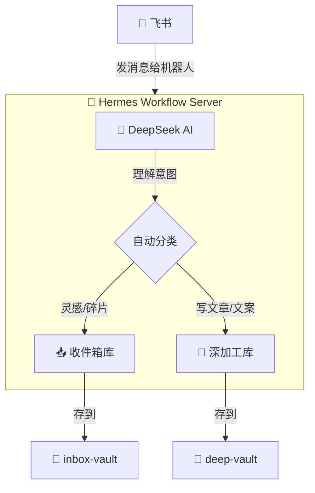

# Hermes Workflow

**飞书 AI 机器人 → 自动分类整理 → Obsidian 知识库**

在飞书上跟机器人聊天，内容自动存入 Obsidian。灵感进收件箱，成品文章进深加工库。

---

## 架构图



---

## 快速开始

### 方式一：Docker 部署（推荐）

```bash
docker-compose up -d
```

前提是电脑上装了 Docker。

### 方式二：本地运行

```bash
pip install -r requirements.txt
cp .env.example .env   # 编辑 .env 填入凭证
python server/main.py
```

## 配置

编辑 `.env` 文件：

| 变量 | 说明 | 获取地址 |
|:----|:----|:---------|
| `FEISHU_APP_ID` | 飞书应用 ID | [open.feishu.cn](https://open.feishu.cn) → 创建应用 |
| `FEISHU_APP_SECRET` | 飞书应用 Secret | 同上 |
| `DEEPSEEK_API_KEY` | DeepSeek API Key | [platform.deepseek.com](https://platform.deepseek.com) |

## 使用示例

| 在飞书里说 | 结果 |
|:-----------|:-----|
| "灵感：AI短视频脚本自动生成工具很有搞头" | ✅ 存到收件箱 |
| "帮我把这个灵感写成一篇公众号文章" | ✅ 生成文章，存到深加工库 |
| "帮我写3条推广文案，关于AI知识管理" | ✅ 生成文案，存到深加工库 |
| "从不同角度分析AI内容创业这个方向" | ✅ 观点碰撞，存到深加工库 |

## 项目结构

```
hermes-workflow/
├── Dockerfile               # 容器镜像
├── docker-compose.yml       # 一键部署
├── .env.example             # 配置模板
├── .gitignore
├── LICENSE                  # MIT 协议
├── server/
│   ├── main.py              # 飞书 Webhook 服务器
│   ├── ai.py                # DeepSeek AI 处理
│   ├── vault_writer.py      # Obsidian 知识库写入
│   └── config.py            # 配置管理
├── requirements.txt
├── setup.py
└── README.md
```

## 技术栈

Python · DeepSeek API · 飞书开放平台 · Obsidian · Docker

## License

MIT
